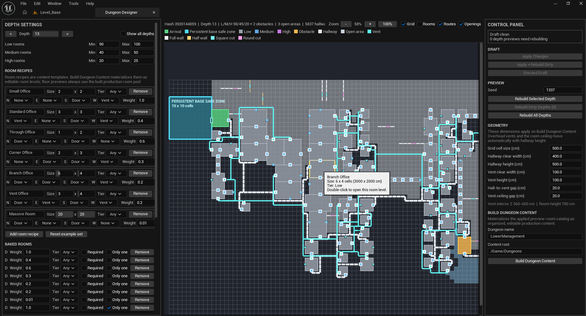
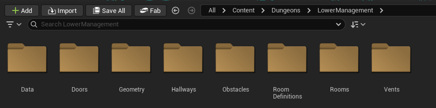
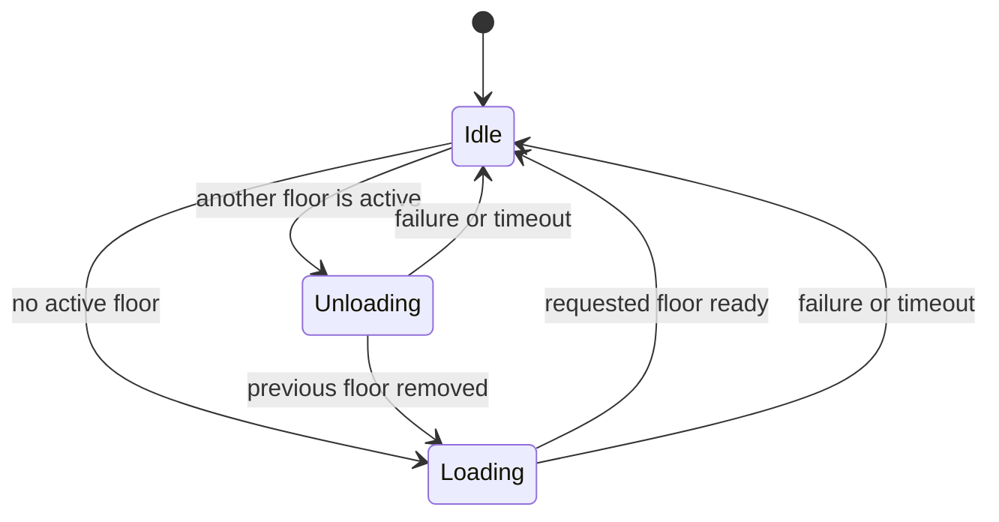
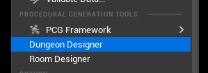
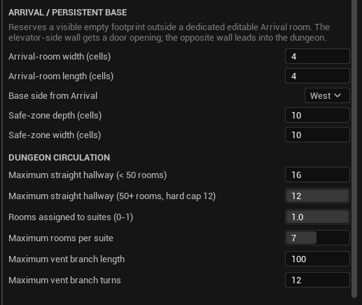
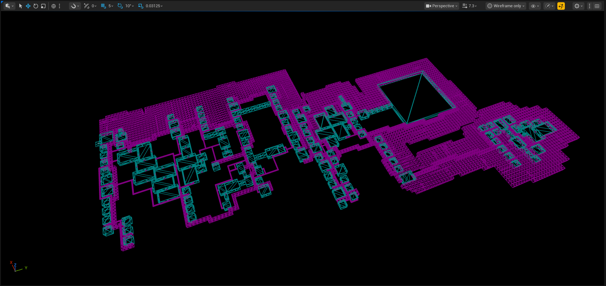

# Dungeon Generator

### A deterministic, production-oriented procedural dungeon system for Unreal Engine 5.8

Dungeon Generator builds dependency-aware, multi-floor layouts from a reproducible seed. It combines abstract progression planning, spatial room placement, multiple circulation systems, custom Unreal Editor tools, runtime floor streaming, and structural validation.

> **Source status:** Private production code. This case study documents the engineering work without distributing the implementation.

## Project context

Dungeon Generator was built for **Lower Management**, a multiplayer cooperative looting game inspired by *Lethal Company*. The system gives the game replayable procedural layouts while preserving hand-authored rooms, encounters, art, and gameplay content.

*The custom Dungeon Designer previewing a deep generated floor from seed 1337. Room recipes and depth rules are authored on the left; deterministic layout, routes, openings, geometry dimensions, and production-content controls are visible in the central preview and right control panel.*

## Project snapshot

| | |
|---|---|
| **Role** | Systems design, C++ implementation, Unreal Editor tooling, procedural-generation architecture |
| **Game** | Lower Management |
| **Genre** | Multiplayer cooperative looting game |
| **Engine** | Unreal Engine 5.8 |
| **Technology** | C++, Slate, Geometry Script, Blueprint APIs, asynchronous tasks, World Subsystems |
| **Architecture** | Separate runtime and editor modules |
| **Current scale** | Approximately 20,000 lines across the private runtime, editor tooling, and test code |
| **Automated coverage** | 24 Unreal Automation tests, including determinism, validation, editor/runtime parity, geometry, and 100-room stress scenarios |
| **Status** | Active production development |

## The designer workflow

The most important feature is not simply that the system can generate a dungeon. It turns procedural design into an editable Unreal content workflow:

```mermaid
flowchart LR
    A["Define room recipes<br/>size + openings + tier + weight"] --> B["Tune dungeon rules<br/>depths + room counts + circulation"]
    B --> C["Preview seeded layouts<br/>until the structure feels right"]
    C --> D["Build Dungeon Content"]
    D --> E["Generated room levels<br/>definitions + modular geometry"]
    E --> F["Double-click a room<br/>to open its Unreal level"]
    F --> G["Customize freely<br/>art + lighting + props + gameplay"]
    G --> H["Runtime generation<br/>streams the customized room"]
```

### 1. Define the room vocabulary

The designer creates every room size the dungeon should use. Each room recipe defines its footprint, eligible tier, relative weight, and north/east/south/west hallway or vent openings.

### 2. Iterate on the dungeon

Depth-specific room counts, progression tiers, the persistent arrival area, hallway constraints, room suites, vent routing, geometry dimensions, and the seed can be adjusted while previewing the generated result.

The designer iterates until the generator consistently produces the kind of dungeon the game needs.

### 3. Build production content

**Build Dungeon Content** materializes the applied design as an organized Unreal content set. The tool creates editable room levels and definitions alongside reusable doors, hallways, vents, obstacles, data, and Geometry Script-generated modular geometry.

*The generated content remains ordinary, organized Unreal project content—not an opaque runtime-only result.*

### 4. Customize rooms as normal Unreal levels

Rooms in the Dungeon Designer preview are interactive. Double-clicking a generated room opens its corresponding level. The designer can then customize that room with any art, lighting, props, Blueprint actors, encounters, or gameplay logic the project requires.

The procedural system owns placement and connectivity. The development team retains normal creative control inside every room.

### 5. Stream the authored result

At runtime, the deterministic floor plan selects and aligns the appropriate authored room modules. Those customized room levels are streamed into the generated floor alongside modular hallways, vents, open areas, and transition geometry.

This combines procedural macro-layout with hand-authored room detail instead of forcing the project to choose between them.

## The problem

Randomly connecting rooms is easy. Generating a dungeon that remains playable, reproducible, and suitable for a real game—while still giving designers ordinary editable levels—is not.

The system needed to:

- Produce the same dungeon plan from the same seed.
- Create progression across multiple depths instead of isolated random floors.
- Guarantee that gated obstacles have valid providers earlier in the run.
- Support designer-authored rooms without making the generator dependent on one fixed content set.
- Keep editor previews consistent with runtime generation.
- Generate and stream only the floor currently needed by gameplay.
- Reject invalid layouts and incompatible content with actionable errors.
- Scale beyond small demonstration layouts while keeping editor iteration practical.

## System architecture

The generator deliberately separates **what the dungeon requires** from **where everything is placed**.

```mermaid
flowchart LR
    A["Generation profile<br/>seed + depth rules + room pools"] --> B["Abstract dependency plan"]
    B --> C["Progression tiers<br/>gates + provider obligations"]
    C --> D["Floor topology<br/>room roles + connections"]
    D --> E["Room selection<br/>authored modules + fallbacks"]
    E --> F["Spatial realization<br/>packing + primary circulation"]
    F --> G["Secondary circulation<br/>vents + open areas"]
    G --> H["Structural validation<br/>connectivity + bounds + contracts"]
    H --> I["Runtime assembly<br/>geometry + streamed room levels"]
```

This split allows the complete multi-floor progression plan to remain deterministic while spatially realizing only the floor requested by the editor or runtime.

## Core engineering decisions

### 1. Plan progression before generating geometry

Dungeon generation begins with an abstract plan built from the deepest floor toward the surface. Gates, structural obstacles, and capability providers are represented as explicit data relationships before room placement begins.

This prevents a common procedural-generation failure: producing visually valid rooms that create impossible progression. A structural validator independently verifies that every gate and obstacle has a matching provider on a valid earlier floor.

### 2. Treat determinism as a production contract

Generation is identified by more than a random seed. The runtime records the seed, requested floor, source profile identity, profile revision, input fingerprint, and generator version.

That metadata gives editor previews and gameplay a shared definition of “the same dungeon.” It also creates a clear invalidation boundary when content or generation semantics change.

### 3. Use one generation path for the editor and runtime

A shared floor-generation service owns production profile resolution, input fingerprinting, deterministic generation, and validation. The Dungeon Designer and runtime assembler do not maintain competing implementations.

Synthetic preview generation is kept intentionally separate. It can use temporary authoring data, but it cannot silently relax the rules used in production.

### 4. Keep expensive planning off the game thread

Production inputs are resolved and snapshotted on the game thread. Deterministic plan generation then runs on the thread pool, and completion returns to the game thread for Unreal object and world operations.

A Blueprint-facing world subsystem owns the lifecycle of the active floor:

Only one generated floor remains active. Elevator presentation stays in Blueprint, while the C++ subsystem handles asynchronous unload, generation, assembly, timeouts, and lifecycle events.

### 5. Make the Dungeon Designer the production content pipeline

The custom **Dungeon Designer** is more than a settings panel. Its materialization pipeline backs the workflow described above:

- It persists the applied room catalog and depth settings as production data.
- It builds editable room levels and companion room definitions.
- It generates the modular hallway, vent, door, seal, obstacle, and open-area geometry kit through Geometry Script.
- It organizes the generated assets into predictable content folders.
- It links preview rooms back to their editable levels for direct double-click navigation.
- It produces the same content later selected and streamed by runtime assembly.

This keeps layout rules, preview data, generated levels, and geometry contracts inside one workflow. Generated structural shells remain separate from designer-authored props, lighting, and gameplay dressing.

| Unreal Editor integration | Arrival and circulation controls |
|---|---|
|  |  |
| Registered as a native editor tool. | Designer-facing constraints for the persistent arrival space, room suites, hallways, and vent routing. |

### 6. Validate generated data independently of the world

The structural validator does not require a `UWorld` or spawned actors. It checks contracts such as:

- Gate and provider consistency across floors.
- Traversal reachability and gated connectivity.
- Room footprints, bounds, overlaps, and routing cells.
- Door and vent socket compatibility.
- Primary hallway, vent, and open-area circulation.
- Separation between progression tiers.
- Geometry-profile and grid-size compatibility.
- Deterministic plan hashes.

Keeping validation separate from visualization and assembly makes failures easier to test and diagnose.

## Spatial generation

Each floor moves through several constrained stages:

1. Build required room roles from the progression plan.
2. Add optional rooms according to the depth profile.
3. Select eligible authored room definitions by role, floor range, tier, weight, and required count.
4. Place room footprints on a coarse grid with configurable clearance.
5. Route primary circulation while respecting room bounds and straight-run limits.
6. Create directly connected room suites where permitted.
7. Route secondary vent circulation through compatible authored openings.
8. Fill eligible unused regions with tier-aware open areas and partition styles.
9. Validate the completed result before geometry or streaming begins.

The generated floor model stays independent of final meshes. Runtime assembly can therefore combine generated modular circulation with streamed designer-authored rooms.

*A materialized generated floor in Unreal Editor wireframe view. The image exposes the scale and connectivity of the constructed geometry without revealing production source code.*

## Testing strategy

The private project currently defines 24 Unreal Automation tests. The suite covers:

- Identical-seed determinism.
- Multi-seed generation sweeps.
- Editor preview and runtime production parity.
- Depth-based scaling.
- Room-definition selection and validation.
- Gate, obstacle, and provider relationships.
- Valid room placement and circulation routes.
- Multi-room suites.
- Tiered progression bands.
- Tier-aware secondary open-area partitioning.
- Modular geometry topology and materialization.
- Runtime floor-streaming contracts.
- 100-room layout and vent-routing stress scenarios.

The stress coverage includes exact 100-room layouts, constrained straight-run limits, and an interactive-time budget for dense vent routing. Hardware-specific benchmark results are kept separate from the architectural claims in this case study.

## Current results

| Engineering objective | Current evidence |
|---|---|
| Reproducible generation | Identical-seed plan comparison and deterministic plan hashing |
| Progression safety | Independent validation of gates, structural obstacles, and provider obligations |
| Editor/runtime consistency | Shared production generation service and dedicated parity tests |
| Large-layout behavior | Automated 100-room placement, hallway, and vent-routing stress coverage |
| Designer usability | Custom Dungeon Designer with integrated preview, level materialization, and Geometry Script content generation |
| Authored-content workflow | Generated preview rooms link to editable Unreal levels that are later streamed into runtime layouts |
| Runtime integration | Blueprint-facing asynchronous floor lifecycle with load, unload, completion, failure, and timeout events |
| Content flexibility | Weighted authored-room pools plus isolated procedural authoring fallbacks |

## Next steps

- Integrate additional production art, lighting, and gameplay content into authored rooms.
- Record and track generation timings across representative target hardware.
- Continue profiling large authored-room catalogs and extreme floor sizes.
- Expand gameplay-facing instrumentation for generation and streaming failures.

---

Built by [JMathisPluto](https://github.com/JMathisPluto).

© 2026 JMathisPluto. All rights reserved. This case study does not grant permission to copy, redistribute, reverse engineer, or use the underlying proprietary implementation.
